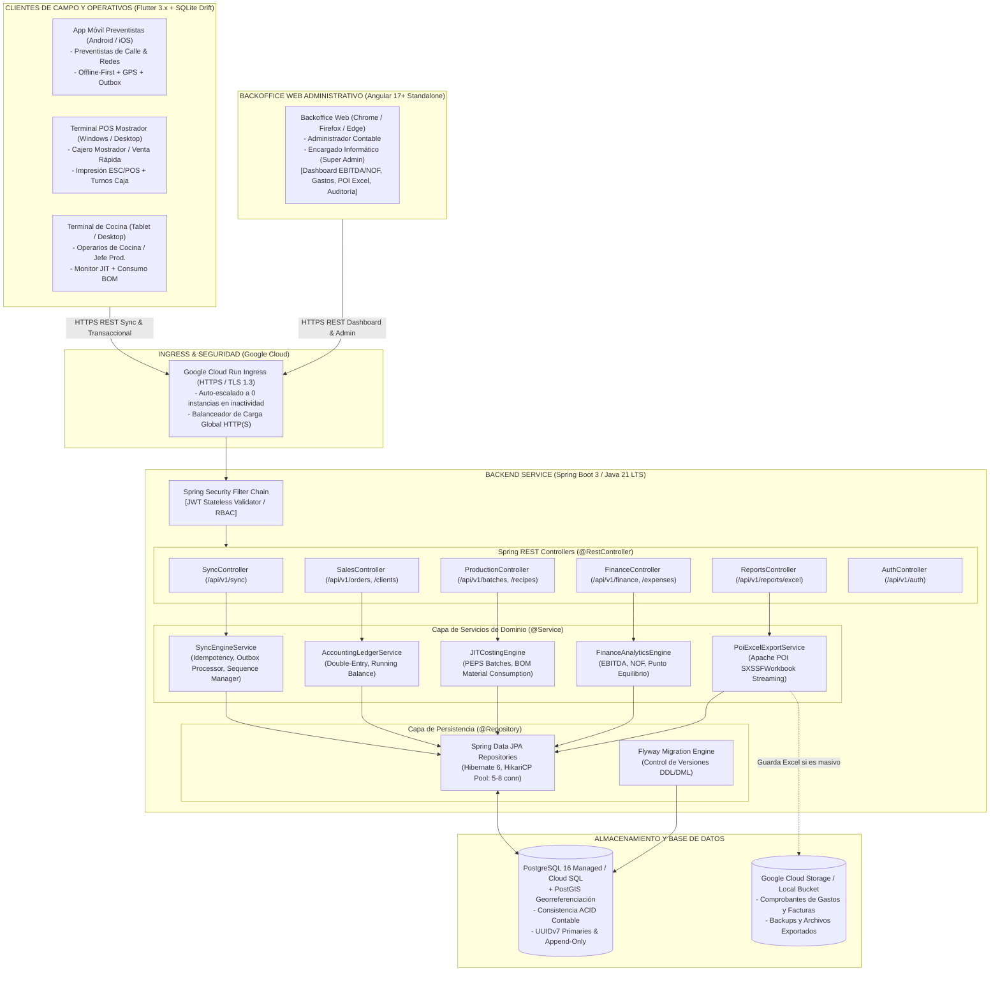
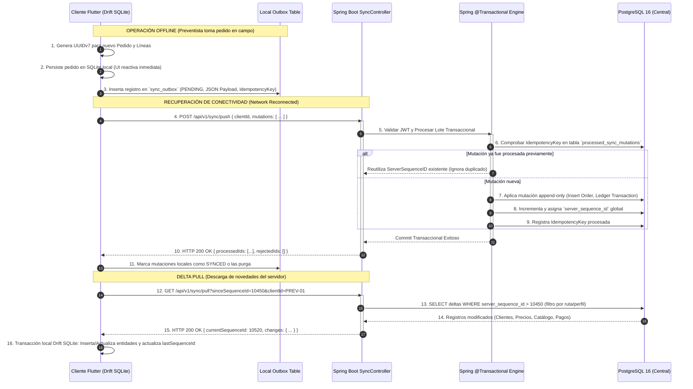
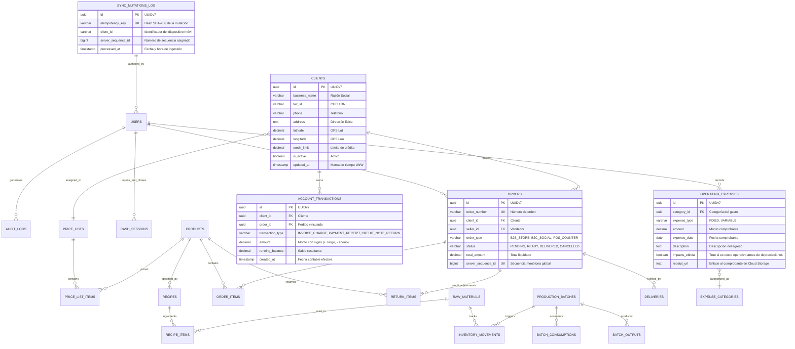
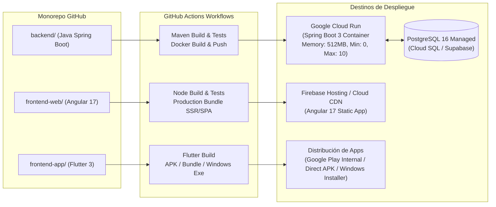

# Arquitectura de Software y Sistemas (Buen Bocado ERP)

---

## 1. Resumen Ejecutivo y Metas de Arquitectura

El sistema **Buen Bocado ERP** es una plataforma integral de gestión empresarial diseñada para optimizar la cadena de valor de una fábrica y distribuidora de sándwiches frescos artesanales con demanda Just-in-Time (JIT) y ciclo de vida de producto ultracorto (12 a 24 horas).

### Metas Técnicas Principales
1. **Arquitectura Tripartita Especializada:**
   - **Backend Central:** API REST robusta, tipada y de alto rendimiento en **Java 21 LTS con Spring Boot 3**, optimizada para despliegue en contenedores serverless (**Google Cloud Run**) con huella de memoria mínima.
   - **Frontend Web Administrativo:** Backoffice analítico y contable desarrollado en **Angular 17+ (TypeScript)** con componentes *standalone*, diseñado para el Administrador Contable y el Encargado Informático (auditoría, configuración, carga de comprobantes, métricas financieras y exportación analítica).
   - **Clientes Operativos y de Campo:** Aplicación multiplataforma en **Flutter 3.x (Dart)** orientada a Preventistas de Calle/Redes (Android/iOS) y Terminales de Operación (Cocina JIT y Punto de Venta de Mostrador en Windows/Desktop/Tablet) con capacidad **Offline-First real**.
2. **Offline-First Idempotente:** Operación ininterrumpida sin conectividad para preventistas y cajeros mediante base de datos local SQLite (Drift ORM) y motor de sincronización bidireccional delta con Outbox Pattern.
3. **Consistencia Transaccional y Contable:** Modelo contable append-only (partida doble y ledger inmutable) en **PostgreSQL 16**, garantizando integridad transaccional ACID en conciliaciones, cuentas corrientes y trazabilidad de lotes PEPS.
4. **Analítica Financiera Precisa:** Motor de cálculo desacoplado para KPIs en tiempo real: EBITDA, EBIT, NOF (Necesidades Operativas de Fondos), Punto de Equilibrio Ponderado, CMV por Lote con costos variables y absorción de costos fijos.
5. **Generación Eficiente de Reportes:** Motor de exportación a Excel (.xlsx) con **Apache POI** en modo streaming (`SXSSFWorkbook`), evitando picos de memoria en el backend.
6. **Seguridad Integral:** Control de acceso basado en roles (RBAC) con Spring Security, autenticación stateless con JWT y pistas de auditoría inmutables.

---

## 2. Stack Tecnológico Acordado y Justificación

```
+-----------------------------------------------------------------------------------+
|                              BUEN BOCADO ERP STACK                                |
+-----------------------------------------------------------------------------------+
| CLIENTES DE CAMPO / OPERATIVOS | Flutter 3.x (Dart)                               |
| Plataformas Objetivo           | Android, iOS, Windows Desktop, Web/Tablet        |
| Persistencia Local             | SQLite embebido vía Drift ORM + SQLCipher        |
| Estado y Reactividad           | Riverpod 2.x + StateNotifier / AsyncNotifier     |
+--------------------------------+--------------------------------------------------+
| FRONTEND WEB ADMINISTRATIVO    | Angular 17+ (TypeScript)                         |
| Arquitectura UI                | Standalone Components, Signals, Reactive Forms   |
| Librerías Visuales             | Angular Material / PrimeNG / Tailwind CSS        |
| Audiencia                      | Administrador Contable & Encargado Informático   |
+--------------------------------+--------------------------------------------------+
| BACKEND CENTRAL API REST       | Java 21 LTS con Spring Boot 3.3+                 |
| Capa de Persistencia           | Spring Data JPA / Hibernate 6, Flyway Migrations |
| Seguridad y Autenticación      | Spring Security 6 + JJWT / Nimbus JOSE (JWT)     |
| Generación de Reportes         | Apache POI 5.x (Streaming SXSSFWorkbook)         |
| Optimización Runtime           | JVM Memory Tuning (SerialGC / AOT / CDS)         |
+--------------------------------+--------------------------------------------------+
| PERSISTENCIA & STORAGE         | PostgreSQL 16 Enterprise + PostGIS               |
| Pool de Conexiones             | HikariCP (Configuración ajustada a Cloud Run)    |
| Almacenamiento de Comprobantes | Google Cloud Storage / S3-Compatible Storage     |
+--------------------------------+--------------------------------------------------+
| INFRAESTRUCTURA & CLOUD        | Google Cloud Run (Serverless Container), Docker  |
+-----------------------------------------------------------------------------------+
```

### 2.1 Backend Central: Java 21 LTS + Spring Boot 3
- **Justificación:**
  - **Madurez Corporativa y Tipado Fuerte:** Java 21 y Spring Boot 3 ofrecen el ecosistema empresarial más confiable para el modelado de lógica contable, financiera y de producción con miles de transacciones concurrentes.
  - **Virtual Threads (Project Loom):** Permite procesar cientos de peticiones de sincronización concurrentes con hilos virtuales ligeros sin sobrecargar el kernel ni requerir programación reactiva compleja.
  - **Control Fino de Memoria y Recursos:** Permite ajustar el Garbage Collector y el tamaño de heap con precisión matemática para mantenerse dentro de los límites estrictos de Cloud Run (256 MB - 512 MB de cuota gratuita/bajo costo).
  - **Generación de Reportes con Apache POI:** Soporte nativo para manipulación de hojas de cálculo complejas con fórmulas financieras, tablas dinámicas y modo streaming (`SXSSF`) con consumo de RAM constante.

### 2.2 Frontend Web Administrativo: Angular 17+ (TypeScript)
- **Justificación:**
  - **Orientado a Gestión y BI Contable:** Angular es el estándar de la industria para backoffices complejos con formularios extensos (carga de comprobantes, facturación, órdenes de compra), validaciones reactivas estrictas y dashboards con múltiples gráficos e indicadores financieros.
  - **Componentes Standalone y Signals:** Angular 17 elimina la sobrecarga de NgModules, reduciendo drásticamente el tamaño del bundle inicial y permitiendo reactividad granular de alto rendimiento mediante Signals.
  - **Seguridad y Control Tipado:** Integración directa con los contratos DTO generados desde OpenAPI/Swagger del backend Spring Boot, asegurando sincronía estricta de interfaces entre backend y frontend.

### 2.3 Clientes Operativos y Campo: Flutter 3.x (Dart)
- **Justificación:**
  - **Capacidad Offline-First Real:** Drift ORM sobre SQLite provee queries reactivas locales (`watch()`), soporte nativo de transacciones locales y cifrado AES-256 con SQLCipher en Android/iOS y Windows.
  - **Multiplataforma Nativa:** Permite compilar binarios nativos para los teléfonos de los preventistas (Android/iOS) y terminales de pantalla táctil en cocina y caja de mostrador (Windows/Tablet) compartiendo el 90%+ del código de lógica, sincronización y validaciones.
  - **Soporte de Periféricos:** Integración directa con impresoras térmicas ESC/POS (USB/Bluetooth/Red) para emisión inmediata de tickets de venta o comandas de cocina sin depender de un navegador.

---

## 3. Topología de Sistemas y Arquitectura



---

## 4. Estructura del Monorepo

La solución se organizará en una estructura monorepo unificada para asegurar coherencia en el versionado, contratos de datos y despliegues sincronizados:

```
buen-bocado-erp/
├── .github/
│   └── workflows/                  # Pipelines CI/CD (Build, Test, Container Push, Deploy)
│       ├── backend-ci.yml          # Build Maven, test unitarios, imagen Docker de Spring Boot
│       ├── frontend-web-ci.yml     # Build Angular, tests, deploy estático
│       └── frontend-app-ci.yml     # Flutter analyze, test y build APK/AAB/Windows
├── backend/                        # API REST Spring Boot 3 (Java 21 LTS)
│   ├── mvnw / mvnw.cmd             # Maven Wrapper
│   ├── pom.xml                     # Dependencias (Spring Boot, JPA, Flyway, POI, JJWT, PostGIS)
│   ├── Dockerfile                  # Multi-stage Dockerfile con optimización JRE y JVM tuning
│   └── src/
│       ├── main/
│       │   ├── java/com/buenbocado/erp/
│       │   │   ├── Application.java
│       │   │   ├── config/          # Spring Security, HikariCP, PostGIS, OpenAPI Swagger Config
│       │   │   ├── shared/          # Excepciones globales, DTOs genéricos, UUIDv7 Generator
│       │   │   ├── auth/            # JWT Filters, UserDetailsService, AuthController, RBAC
│       │   │   ├── sync/            # SyncController, SyncPushService, SyncPullService, Outbox
│       │   │   ├── sales/           # Orders, Clients, AccountTransactions, PriceLists
│       │   │   ├── production/      # Recipes (BOM), ProductionBatches, RawMaterials, Inventory
│       │   │   ├── finance/         # OperatingExpenses, EBITDA/NOF/Breakeven Analytics
│       │   │   └── reports/         # Apache POI Excel Services (SXSSFWorkbook Streaming)
│       │   └── resources/
│       │       ├── application.yml                 # Configuración base
│       │       ├── application-cloudrun.yml        # Configuración perfil Cloud Run (memoria, pool)
│       │       └── db/migration/                   # Scripts Flyway (V1__init.sql, V2__..., etc.)
│       └── test/                    # Tests unitarios e integración (Testcontainers Postgres)
├── frontend-web/                   # Backoffice Administrativo y Contable (Angular 17+)
│   ├── package.json
│   ├── angular.json
│   ├── tsconfig.json
│   ├── tailwind.config.js
│   └── src/
│       ├── app/
│       │   ├── core/                # Interceptors (JWT, Error), Guards (Role, Auth), Services API
│       │   ├── layout/              # Sidebar, Header, Breadcrumbs, Notifications
│       │   ├── shared/              # Pipes contables, Directivas, Modales, Tablas genéricas
│       │   └── features/
│       │       ├── auth/            # Login, recuperación de contraseña
│       │       ├── dashboard/       # Métricas financieras (EBITDA, NOF, Margen, Punto Equilibrio)
│       │       ├── expenses/        # Carga de gastos fijos y variables con comprobantes
│       │       ├── production/      # Monitoreo de recetas y lotes PEPS
│       │       ├── reports/         # Centro de reportes y descarga Excel (.xlsx)
│       │       └── audit/           # Logs inmutables y gestión de usuarios/roles
│       └── assets/                  # Logos, estilos globales, fuentes
├── frontend-app/                   # Clientes de Campo y Operativos (Flutter 3.x)
│   ├── pubspec.yaml                 # Dependencias (drift, sqlite3_flutter_libs, riverpod, dio)
│   ├── analysis_options.yaml
│   └── lib/
│       ├── main.dart
│       ├── core/                    # Constantes, temas visuales, utilitarios de red (Dio Client)
│       ├── database/                # Drift DB (Tablas locales, DAOs, Migraciones SQLite)
│       ├── sync/                    # SyncCoordinator, OutboxRepository, PullProcessor, Worker
│       └── features/
│           ├── auth/                # Login offline/online, almacenamiento seguro en Keystore
│           ├── preventa/            # Catálogo móvil, carrito, GPS, clientes, cobranzas, devoluciones
│           ├── pos/                 # Mostrador: venta ágil, cierre de caja, impresión ESC/POS
│           └── kitchen/             # Monitor JIT, comanda táctil, registro de consumo real
└── docs/                           # Documentación de Arquitectura y Negocio
    ├── requirements/
    │   └── PRD.md                   # Documento de Requerimientos de Producto
    ├── architecture/
    │   └── ARCHITECTURE.md          # Especificación de Arquitectura de Sistemas
    └── api/
        └── openapi.json             # Contrato de API REST exportado
```

---

## 5. Estrategia y Protocolo de Sincronización Offline-First (Spring Boot + Flutter)

La sincronización entre los clientes Flutter y el backend Spring Boot opera bajo el modelo **Local Outbox Pattern** con claves **UUIDv7** y **secuencias monótonas de servidor**.



### 5.1 Políticas de Resolución de Conflictos

| Entidad / Dominio | Estrategia de Resolución | Rationale Contable y Técnico |
| :--- | :--- | :--- |
| **Catálogo y Precios** | **Server Wins** | La administración central en Angular define precios y recetas. Los pedidos tomados offline congelan el precio unitario pactado al momento de emitir el pedido. |
| **Clientes (Datos de Contacto)** | **Last-Write-Wins (LWW) por Campo** | Comparación de timestamp UTC. Se actualizan teléfono y dirección prevaleciendo la edición más reciente. |
| **Pedidos de Preventa y Venta Mostrador** | **Append-Only Inmutable** | Cada pedido es un registro nuevo generado con UUIDv7 único. No hay sobreescritura de pedidos entre distintos vendedores. |
| **Cuentas Corrientes y Cobranzas** | **Ledger Inmutable (Partida Doble)** | El saldo de cuenta corriente nunca es un campo escalar editable. Se calcula dinámicamente como $\sum \text{Cargos} - \sum \text{Abonos}$. Múltiples cobros concurrentes generan recibos independientes sin colisión. |
| **Devoluciones de Sándwiches** | **Append-Only Inmutable (Merma)** | Se registra la nota de crédito y el producto se envía a la cuenta contable de "Pérdida por Devolución" (RN-02), sin reingreso a stock comercializable. |
| **Stock de Insumos y Productos** | **Event Sourcing de Movimientos** | Cada consumo o elaboración es un registro delta (`+X` o `-Y`). El servidor acumula los movimientos. En caso de discrepancia física, se emite una orden de ajuste de inventario. |

---

## 6. Especificación de Contratos de API REST (Springdoc-OpenAPI)

El backend expone contratos REST estructurados y documentados bajo OpenAPI 3.0.

### 6.1 Endpoints Principales

#### Módulo de Autenticación (`/api/v1/auth`)
- `POST /api/v1/auth/login`: Autenticación con credenciales (email y contraseña). Retorna `accessToken` (15 min), `refreshToken` (7 días) y perfil de usuario con roles y permisos.
- `POST /api/v1/auth/refresh`: Renovación de `accessToken` utilizando el `refreshToken` con rotación estricta.
- `POST /api/v1/auth/logout`: Revocación del `refreshToken`.

#### Módulo de Sincronización Offline (`/api/v1/sync`) — Exclusivo Flutter
- `POST /api/v1/sync/push`: Recepción por lotes de mutaciones generadas offline por los clientes móviles o terminales locales.
- `GET /api/v1/sync/pull`: Obtención de cambios incrementales (deltas) desde un `sinceSequenceId` dado.

#### Módulo Financiero y BI (`/api/v1/finance`) — Exclusivo Backoffice Angular
- `GET /api/v1/finance/dashboard`: Resumen ejecutivo de KPIs financieros en tiempo real (Ventas del día, Utilidad Bruta, EBITDA acumulado del mes, NOF y Punto de Equilibrio actual).
- `GET /api/v1/finance/income-statement`: Estado de resultados proforma por rango de fechas (Ingresos, CMV, Pérdidas por Devolución, Gastos Operativos, EBITDA, Depreciaciones, EBIT).
- `GET /api/v1/finance/working-capital`: Cálculo detallado de NOF (Cuentas por Cobrar + Inventarios - Cuentas por Pagar a Proveedores).
- `GET /api/v1/finance/breakeven`: Análisis del Punto de Equilibrio Ponderado actual según la mezcla de ventas real.
- `POST /api/v1/finance/expenses`: Registro de un gasto operativo (fijo o variable) con comprobante y categorización.
- `GET /api/v1/finance/expenses`: Listado filtrado y paginado de gastos operativos.

#### Módulo de Exportación de Reportes (`/api/v1/reports`) — Apache POI Streaming
- `GET /api/v1/reports/excel/sales`: Exportación masiva de ventas detalladas a formato `.xlsx`.
- `GET /api/v1/reports/excel/income-statement`: Exportación del balance y estado de resultados a formato `.xlsx`.
- `GET /api/v1/reports/excel/clients-ledger`: Exportación de cuentas corrientes y antigüedad de deuda.
- `GET /api/v1/reports/excel/production-costs`: Exportación del costeo de lotes PEPS y consumo de insumos.

### 6.2 Ejemplos de Contratos JSON (Payloads)

#### Contrato: `POST /api/v1/sync/push`
```json
{
  "clientId": "PREV-ANDROID-089A",
  "deviceTimestamp": "2026-09-28T09:30:00Z",
  "mutations": [
    {
      "idempotencyKey": "a9f8e43b-512c-4734-b2e1-4560124a98b1",
      "entityType": "ORDER",
      "operation": "CREATE",
      "entityId": "018f3a2c-9a11-7001-83f1-000000000001",
      "payload": {
        "orderNumber": "PED-20260928-0042",
        "clientId": "018f3a00-1111-7000-8000-000000000010",
        "sellerId": "018f3900-2222-7000-8000-000000000020",
        "orderType": "B2B_STORE",
        "deliveryWindowStart": "2026-09-29T08:00:00Z",
        "deliveryWindowEnd": "2026-09-29T10:00:00Z",
        "items": [
          {
            "productId": "018f3a55-3333-7000-8000-000000000030",
            "quantity": 24,
            "unitPrice": 1250.00,
            "subtotal": 30000.00
          }
        ],
        "totalAmount": 30000.00,
        "paymentMethodExpected": "CURRENT_ACCOUNT"
      }
    }
  ]
}
```

#### Contrato: `GET /api/v1/finance/dashboard`
```json
{
  "period": "2026-09",
  "asOf": "2026-09-28T09:35:00Z",
  "metrics": {
    "totalRevenue": 4850000.00,
    "cogsRealPeps": 2425000.00,
    "returnsLossAmount": 72750.00,
    "grossProfit": 2352250.00,
    "grossMarginPercentage": 48.5,
    "operatingExpensesFixed": 1100000.00,
    "operatingExpensesVariable": 340000.00,
    "ebitda": 912250.00,
    "ebitdaMarginPercentage": 18.81,
    "depreciation": 45000.00,
    "ebit": 867250.00,
    "workingCapitalNeeds": {
      "accountsReceivable": 1350000.00,
      "inventoryValue": 620000.00,
      "accountsPayable": 890000.00,
      "nofTotal": 1080000.00
    },
    "breakEvenAnalysis": {
      "fixedCosts": 1100000.00,
      "weightedContributionMargin": 0.485,
      "breakEvenRevenue": 2268041.24,
      "currentRevenuePercentageOfBreakeven": 213.84
    }
  }
}
```

---

## 7. Optimización de Spring Boot 3 para Google Cloud Run

Google Cloud Run cobra por CPU y memoria asignada por milisegundo durante el procesamiento de solicitudes, y ofrece una cuota mensual gratuita generosa si la memoria por instancia se mantiene controlada (típicamente $\le 512\text{ MB}$ por contenedor).

### 7.1 Estrategia de JVM Tuning para Bajo Consumo de RAM
Para correr Spring Boot 3 en un contenedor con límite estricto de memoria de **512 MB** sin sufrir despidos por `OOMKilled`:

1. **Selección del Garbage Collector:**
   - **`-XX:+UseSerialGC`**: El recolector G1 por defecto en OpenJDK reserva un overhead de memoria sustancial (estructuras de memoria RSet) que puede consumir 100 MB adicionales solo en el recolector. Para contenedores de 1 o 2 vCPU en Cloud Run, **SerialGC** reduce drásticamente el overhead del recolector a menos de 15 MB de RAM.
2. **Límites de Heap Explícitos:**
   - `-Xms128m -Xmx384m`: Permite que la aplicación inicie con 128 MB de heap y crezca hasta 384 MB como máximo absoluto, dejando los 128 MB restantes del contenedor para Metaspace, threads nativos y buffers del kernel de Linux.
   - `-XX:MaxRAMPercentage=75.0`: En caso de redimensionar el contenedor dinámicamente.
3. **Optimización de Compilación JIT para Reducir Cold Starts:**
   - `-XX:+TieredCompilation -XX:TieredStopAtLevel=1`: En ambientes de prueba o escalado rápido a cero, el nivel 1 de C1 compiler reduce el tiempo de arranque en un 40% y ahorra memoria reservada por el CodeCache.
   - **Spring Boot 3 AOT / AppCDS (Application Class Data Sharing):** Durante la fase de build con Docker, se genera un archivo CDS de las clases de Spring Framework y de la aplicación, acelerando el arranque en Cloud Run a menos de 2.5 segundos.
4. **Lazy Initialization Selectiva:**
   - `spring.main.lazy-initialization=false` para servicios críticos (evita latencia en la primera petición), pero inicialización diferida en componentes de reportes secundarios.

```dockerfile
# Multi-stage Dockerfile optimizado para Cloud Run
FROM eclipse-temurin:21-jdk-alpine AS builder
WORKDIR /app
COPY pom.xml mvnw ./
COPY .mvn .mvn
RUN ./mvnw dependency:go-offline -B
COPY src ./src
RUN ./mvnw clean package -DskipTests

FROM eclipse-temurin:21-jre-alpine AS runner
WORKDIR /app
RUN addgroup -S spring && adduser -S spring -G spring
USER spring:spring
COPY --from=builder /app/target/*.jar app.jar

# Flags de JVM optimizadas para Cloud Run (512 MB RAM limit)
ENV JAVA_TOOL_OPTIONS="-XX:+UseSerialGC \
                       -Xms128m \
                       -Xmx384m \
                       -XX:MaxMetaspaceSize=96m \
                       -XX:+ExitOnOutOfMemoryError \
                       -Djava.security.egd=file:/dev/./urandom"

EXPOSE 8080
ENTRYPOINT ["java", "-jar", "app.jar"]
```

### 7.2 Dimensionamiento del Pool de Conexiones (HikariCP)
En arquitecturas Serverless como Cloud Run, múltiples réplicas efímeras de contenedores pueden levantarse concurrentemente durante picos de tráfico matutinos (cuando los preventistas sincronizan pedidos entre las 06:00 y las 07:00).
- **Problema:** Si cada contenedor abre un pool por defecto de 30 conexiones a PostgreSQL, 10 contenedores agotarán el límite de conexiones del motor de base de datos (`max_connections = 100`).
- **Solución Arquitectónica:**
  - `spring.datasource.hikari.maximum-pool-size=5` (máximo 8). Con hilos virtuales de Java 21 y transacciones de alta velocidad ($\le 20\text{ ms}$), 5 conexiones por contenedor soportan con holgura más de 200 peticiones por segundo por réplica.
  - `spring.datasource.hikari.minimum-idle=2`
  - `spring.datasource.hikari.idle-timeout=30000` (30 segundos)
  - `spring.datasource.hikari.max-lifetime=900000` (15 minutos)
  - `spring.datasource.hikari.connection-timeout=10000` (10 segundos)

### 7.3 Generación Streaming de Excel con Apache POI (`SXSSFWorkbook`)
La exportación de balances anuales o libros de ventas con 10,000+ filas en una librería tradicional (`XSSFWorkbook`) carga todo el árbol de nodos DOM XML en la memoria Heap de Java, consumiendo más de 200 MB de RAM y provocando `OutOfMemoryError` en Cloud Run.
- **Implementación con SXSSF:**
  ```java
  // Modo streaming con ventana deslizante de 100 filas en memoria
  SXSSFWorkbook workbook = new SXSSFWorkbook(100);
  workbook.setCompressTempFiles(true); // Comprime temporales en disco efímero
  SXSSFSheet sheet = workbook.createSheet("Libro_Ventas_Contable");
  // Escritura por streaming hacia el OutputStream de la respuesta HTTP
  ```
  Las filas que superan la ventana de 100 se flashean automáticamente a archivos temporales en el sistema de archivos efímero `/tmp` del contenedor, manteniendo el consumo de memoria del proceso en menos de **25 MB de RAM** sin importar la cantidad de filas.

---

## 8. Modelo de Datos Relacional y Migraciones con Flyway

El esquema de base de datos se mantiene versionado y reproducible mediante **Flyway** en el paquete `src/main/resources/db/migration/`.



---

## 9. Seguridad, Autenticación y RBAC

### 9.1 Filtro Stateless en Spring Security 6
1. **Hasheo de Contraseñas:** `Argon2PasswordEncoder` con parámetros OWASP recomendados (memory: 64 MB, iterations: 3, parallelism: 1) o `BCryptPasswordEncoder` con factor de coste 12.
2. **Ciclo de Vida de Tokens:**
   - **Access Token (JWT):** Firmado con clave asimétrica RSA-256 o HMAC-SHA256 rotativa, expiración de 15 minutos. Claims mínimos: `sub` (User ID), `role`, `authorities`, `tenant_id`.
   - **Refresh Token:** Cadena criptográfica aleatoria de 64 bytes persistida en base de datos central con revocación instantánea ante cierre de sesión o reporte de pérdida de dispositivo.
3. **Filtro de Autorización por Perfil (RBAC):**
   ```java
   @Bean
   public SecurityFilterChain filterChain(HttpSecurity http) throws Exception {
       return http
           .csrf(AbstractHttpConfigurer::disable)
           .sessionManagement(s -> s.sessionCreationPolicy(SessionCreationPolicy.STATELESS))
           .authorizeHttpRequests(auth -> auth
               .requestMatchers("/api/v1/auth/**").permitAll()
               .requestMatchers("/api/v1/finance/**", "/api/v1/reports/**").hasAnyRole("ADMIN_CONTABLE", "ENCARGADO_INFORMATICO")
               .requestMatchers("/api/v1/sync/**").hasAnyRole("PREVENTISTA_CALLE", "PREVENTISTA_REDES", "CAJERO_MOSTRADOR", "OPERARIO_COCINA", "ENCARGADO_INFORMATICO")
               .anyRequest().authenticated()
           )
           .addFilterBefore(jwtAuthenticationFilter, UsernamePasswordAuthenticationFilter.class)
           .build();
   }
   ```

---

## 10. Pipeline de Despliegue y Estrategia DevOps



---

## 11. Conclusión

La arquitectura acordada consolida una solución de grado industrial:
1. **Solidez Operativa:** Los clientes **Flutter** garantizan una toma de pedidos y facturación en mostrador rápida y sin caídas por falta de señal móvil, aprovechando la persistencia reactiva de **Drift SQLite**.
2. **Precisión Administrativa:** El backoffice **Angular 17+** proporciona al Administrador Contable una plataforma moderna, reactiva y especializada para el análisis financiero avanzado (EBITDA, NOF, Punto de Equilibrio) y la carga de comprobantes.
3. **Eficiencia en la Nube:** El backend **Spring Boot 3** en **Java 21**, optimizado con *SerialGC*, pool ajustado en *HikariCP* y streaming en *Apache POI*, asegura alta confiabilidad y costo de infraestructura prácticamente nulo en **Google Cloud Run**.
