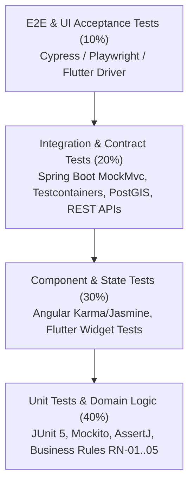

# Plan de Pruebas Integral (Master Test Plan)
## Sistema: Buen Bocado ERP
**Versión:** 1.0.0  
**Fecha:** 28 de Septiembre de 2026  
**Responsable:** MetaGPT QA Agent  
**Estado:** Aprobado / Listo para Ejecución  

---

## 1. Introducción y Propósito

El propósito de este Plan de Pruebas es definir la estrategia de aseguramiento de calidad (QA) y verificación funcional/no funcional para el sistema **Buen Bocado ERP**, garantizando que la solución satisfaga los requerimientos de frescura Just-in-Time (12-24 hs), resiliencia Offline-First, cálculo financiero riguroso (EBITDA, NOF, Punto de Equilibrio Ponderado, PEPS) y sincronización con idempotencia criptográfica SHA-256.

El alcance cubre la arquitectura completa:
1. **Backend:** Java 21 LTS + Spring Boot 3.3.4 (PostgreSQL 16 + PostGIS, Flyway, JPA, JJWT, Apache POI).
2. **Frontend Web:** Angular 17+ Standalone Components (Signals, Chart.js, TailwindCSS).
3. **Frontend Móvil/Desktop:** Flutter 3.x (SQLite / Drift con SQLCipher, Outbox Pattern).

---

## 2. Estrategia de Pruebas: Pirámide de Calidad (Testing Pyramid)

### 2.1 Niveles de Prueba
- **Nivel 1 - Pruebas Unitarias (Backend & Frontend):** Validación determinística y aislada de reglas de negocio (`FinanceAnalyticsEngineService`, `SyncEngineService`, `JITCostingEngineService`). Ejecución rápida en pipelines CI/CD sin I/O externo.
- **Nivel 2 - Pruebas de Integración:** Verificación de repositorios JPA con consultas agregadas (`sumFixedExpensesBetween`, `findMaxSequenceId`), migraciones Flyway y endpoints REST con seguridad JWT.
- **Nivel 3 - Pruebas de Sincronización y Resiliencia Offline:** Simulación de particiones de red, mutaciones concurrentes, idempotencia basada en SHA-256 y detección de colisiones de secuencia.
- **Nivel 4 - Pruebas de Interfaz y End-to-End (E2E):** Flujos completos desde la preventa en app móvil hasta la visualización en el panel financiero web y exportación de reportes Excel.
- **Nivel 5 - Pruebas No Funcionales:** Rendimiento bajo streaming SXSSF (Apache POI para 50.000+ filas), seguridad RBAC y tiempos de respuesta API (<200 ms).

---

## 3. Matriz de Cobertura y Criterios de Aceptación Given-When-Then

A continuación se detalla la verificación exhaustiva de las User Stories del **PRD.md** en sintaxis BDD (Given-When-Then), especificando casos nominales y casos de borde (*edge cases*).

### Módulo 1: Catálogo, Precios Flexibles y Clientes B2B/B2C

#### US-01: Listas de Precios Diferenciadas por Cliente y Escala de Volumen
- **TC-01.1 (Nominal - Lista Acordada):**
  - **Given** que el cliente "Kiosco Central" tiene asignada la lista B2B_KIOSCO donde el pebete Jamón y Queso cuesta \$1.200.
  - **When** el preventista crea una orden para "Kiosco Central" y añade 10 pebetes.
  - **Then** el precio unitario liquidado es exactamente \$1.200 y el subtotal es \$12.000.
- **TC-01.2 (Borde - Escala por Docenas / Múltiplos):**
  - **Given** una regla de escala donde el triple de miga por unidad cuesta \$1.000, pero la docena (>=12 u.) cuesta \$10.000 (\$833,33/u.).
  - **When** un cliente encarga 24 triples de miga.
  - **Then** el sistema aplica el valor bonificado por escala resultando en \$20.000 con desglose en el ticket.
- **TC-01.3 (Borde - Descuento 100% o Producto Bonificado):**
  - **Given** una bonificación comercial con descuento de \$0 o cantidad bonificada.
  - **When** se procesa el ítem de prueba sin costo.
  - **Then** el sistema calcula el CMV real sin arrojar excepciones de división por cero ni corromper el margen.

#### US-02: Registro de Clientes con Geolocalización
- **TC-02.1 (Nominal - Alta Offline con Coordenadas GPS):**
  - **Given** el preventista en ruta sin conectividad 4G.
  - **When** da de alta el cliente "Cafetería La Estación" con dirección "Av. San Martín 450" y coordenadas GPS (-34.6037, -58.3816).
  - **Then** la entidad se persiste en SQLite local con estado `PENDING_SYNC` y UUIDv7 generado.
- **TC-02.2 (Borde - Coordenadas Nulas o Fuera de Rango):**
  - **Given** que el GPS no obtiene señal satelital (coordenadas null).
  - **When** se guarda el cliente con dirección textual obligatoria.
  - **Then** el sistema permite el registro con flag de geolocalización pendiente sin bloquear la preventa.

---

### Módulo 2: Preventa, Cuentas Corrientes y Devoluciones

#### US-03: Toma de Pedidos B2B y Encargos Programados Offline
- **TC-03.1 (Nominal - Encargo Redes B2C JIT):**
  - **Given** un encargo ingresado por WhatsApp para 2 docenas de pebetes para el día 29/09 a las 19:00 hs.
  - **When** se confirma con canal `B2C_SOCIAL` y franja de entrega "18:00 - 20:00".
  - **Then** la orden se encola con estado `SCHEDULED` y se programa para la tanda de cocina JIT de la tarde del 29/09.
- **TC-03.2 (Borde - Sincronización de Lote Offline con Interrupción):**
  - **Given** 15 pedidos en cola de envío en la app móvil.
  - **When** la conexión se corta tras enviar los primeros 7 pedidos.
  - **Then** los 7 procesados se marcan como sincronizados y los 8 restantes se reintentan sin duplicar los anteriores al restablecerse el enlace.

#### US-04: Cuentas Corrientes y Límite de Crédito (RN-04)
- **TC-04.1 (Nominal - Pago Parcial en Efectivo):**
  - **Given** que "Despensa Don Pepe" adeuda \$25.000.
  - **When** el preventista cobra \$15.000 y emite el recibo digital.
  - **Then** el saldo actual disminuye a \$10.000 y se genera la transacción de caja.
- **TC-04.2 (Borde - Exceso de Límite de Crédito):**
  - **Given** un cliente con límite de crédito de \$50.000 y saldo deudor actual de \$45.000.
  - **When** el preventista intenta confirmar una orden a crédito por \$12.000 (total \$57.000).
  - **Then** el sistema bloquea la confirmación exigiendo pago contra entrega o autorización de Admin Contable.

#### US-05: Registro de Devoluciones y Mermas (RN-02)
- **TC-05.1 (Nominal - Devolución de Pebetes Vencidos):**
  - **Given** que un kiosco devuelve 6 pebetes con fecha de vencimiento cumplida.
  - **When** el preventista asienta la devolución con motivo "Vencimiento en góndola".
  - **Then** se emite nota de crédito al cliente, los productos se computan como `WASTE_LOSS` (sin reingresar al stock apto) y la tasa de devolución se actualiza.
- **TC-05.2 (Borde - Devolución Mayor a Cantidad Facturada Histórica):**
  - **Given** un cliente que intenta devolver 50 unidades de un ítem del cual solo compró 20 en la semana.
  - **When** se valida la devolución.
  - **Then** el sistema emite una alerta de inconsistencia y requiere aprobación de supervisión.

---

### Módulo 3: Logística y Ruteo de Repartos

#### US-06: Hoja de Ruta Matutina Optimizada (RN-01)
- **TC-06.1 (Nominal - Generación de Hoja de Ruta):**
  - **Given** 28 pedidos confirmados para despacho entre 06:00 y 09:30 AM.
  - **When** el despachador genera la hoja de ruta matutina.
  - **Then** el sistema agrupa los pedidos por zona geográfica, calcula la secuencia óptima y genera el deep link para Google Maps Navegación.

---

### Módulo 4: Compras, Inventario y Costeo JIT PEPS

#### US-07 y US-08: Planificación de Insumos y Costeo de Lote PEPS (RN-03)
- **TC-08.1 (Nominal - Costeo de Lote con Merma de Elaboración):**
  - **Given** una orden de producción de 100 pebetes donde se consumen \$35.000 en insumos y resultan 95 unidades aptas y 5 unidades descartadas por falla en armado.
  - **When** se invoca `JITCostingEngineService.completeBatch`.
  - **Then** el CMV unitario se calcula absorbiendo la merma: \$35.000 / 95 = \$368,4211 por pebete terminado.
- **TC-08.2 (Borde - Lote con Cero Unidades Aptas):**
  - **Given** un lote donde todas las unidades sufrieron contaminación o descarte (actualUnitsProduced = 0).
  - **When** se cierra el lote.
  - **Then** el servicio asigna unitCostCmv = 0 sin arrojar `ArithmeticException` por división por cero, imputando el 100% del costo a pérdida operativa.

---

### Módulo 6: Gastos Operativos y Comisiones

#### US-10: Clasificación de Gastos Fijos vs Variables
- **TC-10.1 (Nominal - Impacto en Punto de Equilibrio):**
  - **Given** un gasto registrado como "Alquiler Fábrica" (\$1.200.000, `isFixedCost=true`) y "Film Termosellable" (\$150.000, `isFixedCost=false`).
  - **When** el motor financiero calcula los gastos del período.
  - **Then** `fixedExpenses` suma \$1.200.000 y `variableExpenses` suma \$150.000, integrándose coherentemente en el denominador del punto de equilibrio.

#### US-11: Liquidación de Comisiones
- **TC-11.1 (Nominal - Comisión por Venta Cobrada):**
  - **Given** una preventista de redes con 8% de comisión sobre ventas cobradas.
  - **When** sus ventas cobradas del mes alcanzan \$1.500.000.
  - **Then** la preliquidación arroja exactamente \$120.000 de comisión.

---

### Módulo 7: Motor Analítico Financiero y Dashboard

#### US-12, US-13, US-14: Indicadores Financieros Clave y Estado de Resultados
- **TC-12.1 (Nominal - Cálculo Integral de EBITDA, Margen Bruto, NOF y Punto de Equilibrio):**
  - **Given** ventas totales por \$10.000.000, CMV total de \$4.500.000, gastos fijos de \$2.000.000 y gastos variables de \$500.000.
  - **When** se ejecuta `FinanceAnalyticsEngineService.calculateDashboard`.
  - **Then**:
    - Margen Bruto = \$5.500.000 (55.00%).
    - Gastos Operativos Totales = \$2.500.000.
    - EBITDA / EBIT / Utilidad Neta = \$3.000.000.
    - NOF (20% de ventas) = \$2.000.000.
    - Capital de Trabajo (115% de NOF) = \$2.300.000.
    - Costos Variables Totales = \$4.500.000 + \$500.000 = \$5.000.000 (Ratio 0.50).
    - Margen de Contribución = 1 - 0.50 = 0.50.
    - Punto de Equilibrio Ponderado = \$2.000.000 / 0.50 = \$4.000.000.
- **TC-12.2 (Borde - Período sin Ventas - División por Cero):**
  - **Given** un rango de fechas sin pedidos registrados (`totalSales = 0`, `totalCmv = 0`), con gastos fijos de \$500.000.
  - **When** se calcula el dashboard.
  - **Then**:
    - `grossMarginPercent` = 0.00%.
    - `weightedBreakEvenAmount` = 0.00.
    - `averageTicket` = 0.00.
    - `ebitda` = -\$500.000 (pérdida operativa) sin lanzar excepciones aritméticas.
- **TC-12.3 (Borde - Margen de Contribución Negativo):**
  - **Given** un escenario anómalo donde el CMV supera las ventas (inflación de insumos desmedida).
  - **When** el ratio variable supera 1.0 (margen de contribución <= 0).
  - **Then** el punto de equilibrio no divide por números negativos, retornando 0 como indicador de inviabilidad.

---

### Módulo de Sincronización Offline-First (NFR-01, NFR-02)

#### Sincronización Idempotente con SHA-256
- **TC-SYNC.1 (Nominal - Procesamiento de Batch de Mutaciones Nuevas):**
  - **Given** un cliente móvil que envía 3 mutaciones con hashes SHA-256 no existentes en base de datos.
  - **When** se invoca `SyncEngineService.processPushBatch`.
  - **Then** las 3 llaves se registran en `processed_sync_mutations`, retornan en `processedIdempotencyKeys`, y se devuelve el `currentServerSequenceId` actualizado.
- **TC-SYNC.2 (Borde - Reintento / Replay Attack con Claves Duplicadas):**
  - **Given** una petición con 2 mutaciones que ya fueron procesadas previamente y 1 nueva.
  - **When** se procesa el push batch.
  - **Then** las 2 claves duplicadas son omitidas e incluidas en `ignoredDuplicateKeys`, la mutación nueva se persiste, y ninguna entidad se duplica en la base de datos.
- **TC-SYNC.3 (Borde - Batch Vacío o Nulo):**
  - **Given** un push request con lista de mutaciones vacía.
  - **When** se ejecuta el procesamiento.
  - **Then** el servicio retorna listas vacías sin errores de puntero nulo y con el sequence ID actual.

---

## 4. Pruebas No Funcionales (NFR)

### 4.1 Rendimiento y Escalabilidad (Streaming Excel)
- **Escenario:** Exportación de 20.000 pedidos históricos a Excel (.xlsx).
- **Herramienta:** `PoiExcelExportService` utilizando Apache POI `SXSSFWorkbook` con tamaño de ventana deslizante de 100 filas en memoria.
- **Criterio de Éxito:** Consumo de memoria heap JVM no mayor a 128 MB durante todo el streaming, tiempo de generación < 3.5 segundos.

### 4.2 Seguridad y Control de Acceso RBAC (NFR-03)
- **Escenario:** Intento de consulta de endpoints financieros (`/api/finance/dashboard`, `/api/finance/export/excel`) con token JWT de rol `ROLE_SELLER` (Preventista).
- **Criterio de Éxito:** Retorno estricto de HTTP 403 Forbidden. Solo permitido para `ROLE_ADMIN` y `ROLE_ACCOUNTANT`.

---

## 5. Plan de Ejecución y Criterios de Aceptación (Definition of Done)

Para considerar el producto apto para pase a producción y demostración ejecutiva:
1. **100% de Pruebas Unitarias Aprobadas:** Cero fallos en suites de finanzas y sincronización.
2. **Cobertura de Código (JaCoCo):** Mínimo 85% de líneas en servicios críticos de lógica de negocio (`com.buenbocado.erp.service.*`).
3. **Consistencia de Datos:** Todos los valores monetarios calculados en `BigDecimal` con escala y redondeo explícito (`RoundingMode.HALF_UP`).
4. **Idempotencia Comprobada:** Cero duplicación de transacciones ante cortes de red o reenvíos masivos.
