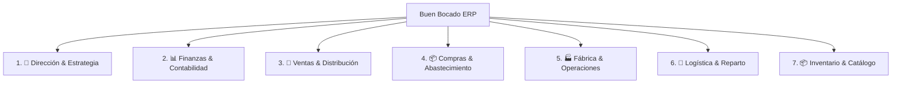

# Registro de Auditoría de Requerimientos y Evolución del Modelo de Negocio
## Proyecto: Buen Bocado ERP
### Documento de Control de Cambios, Entrevistas y Decisiones Estratégicas (ADR Funcional)

---

> **Autor:** MetaGPT_ProductManager (Chief Product Officer)  
> **Aprobador:** Fundador y Dirección General de Buen Bocado  
> **Fecha:** 29 de Septiembre de 2026  
> **Estado:** Aprobado en Fase de Auditoría y Debate  

---

## 1. Bitácora de Entrevistas y Evolución del Alcance

Durante las sesiones de trabajo con la Dirección de Buen Bocado, el sistema transitó por sucesivas fases de maduración basadas en entrevistas y requerimientos operativos reales:

| Ronda / Sesión | Requerimientos & Hallazgos de la Entrevista | Decisión Estratégica Adoptada | Estado |
| :--- | :--- | :--- | :---: |
| **Sesión 1: Finanzas & CMV** | • Necesidad de ver el CMV desagregado por insumos reales (pan, queso, fiambre, packaging). • Unificación de gastos operativos fijos y variables en una sola corriente con fecha y comprobante. • Manejo de precios diferenciales según cliente B2B. | Implementación del motor `FinanceAnalyticsEngineService` con costeo PEPS y persistencia relacional en PostgreSQL. | ✅ Consolidado |
| **Sesión 2: Devoluciones & CMI** | • Las devoluciones de clientes NO deben restarse de las ventas brutas porque el costo de los insumos ya fue absorbido en el CMV al fabricarse. • Creación de un Cuadro de Mando Integral (CMI / Balanced Scorecard) con 4 perspectivas: Financiera (ROA, ROE, EBITDA), Procesos (tasa de devolución, productividad u/h-h), Clientes (ticket promedio, producto más demandado). • Cálculo de Punto de Equilibrio Ponderado predictivo por tipo de sándwich para el mes corriente. | Separación contable de devoluciones como "Pérdida por Calidad/Desperdicio" sin distorsionar el ingreso bruto. Incorporación de matriz CMI y simulador de Break-Even. | ✅ Consolidado |
| **Sesión 3: Reorganización Modular** | • La interfaz inicial acumulaba demasiada información junta, generando sensación de desorden y confusión. • Necesidad de separar la operación en pestañas independientes. | Transición de panel único a Suite ERP Modular con Menú Lateral Slate (`/estrategia`, `/finanzas`, `/ventas`, `/fabrica`, `/compras`). | ✅ Consolidado |
| **Sesión 4: Cadena de Suministro** | • Cierre del circuito de compras a proveedores de insumos (frigoríficos, panificadoras, lácteas). • Semáforo de stock en cámara de frío y planificación matutina de compras (US-07). | Implementación de `Supplier`, `PurchaseInvoice`, `PurchaseItem` y `SupplyService` con actualización en vivo de inventario y último costo de compra. | ✅ Consolidado |
| **Sesión 5 (Actual): Debate & Auditoría** | • **Quiebre del paradigma 24h:** Los sándwiches aguantan **hasta 5 días (120 horas)** refrigerados en cámara de frío. • **Modelo Híbrido MTO + MTS:** El cliente particular (redes/mostrador) exige despacho inmediato (marketing de conversión rápida), exigiendo producción para stock sin pedido previo (MTS). El cliente B2B mantiene pedidos programados (MTO). • **Apertura de Catálogo:** Nuevos elaborados (pizzas frías, helados, jugos, postres) y productos de reventa (gaseosas, snacks) agrupables en **Combos/Packs**. • **ERP Robusto:** Cada pestaña debe tener sus sub-pestañas canónicas de nivel profesional. | **En curso:** Auditoría, redefinición del PRD y diseño de la arquitectura de submódulos estándar ERP. | 🔄 En Debate |

---

## 2. Los 3 Cambios de Paradigma del Negocio

### 2.1 Cambio 1: De "Producción 100% Bajo Pedido (JIT/MTO)" a "Modelo Híbrido MTO + MTS"
- **Paradigma Anterior:** Todo sándwich se producía únicamente si existía un pedido confirmado previo de 12 a 24 horas, asumiendo caducidad a las 24 horas.
- **Nueva Realidad:**
  1. **Canal B2B (Kioscos, Cafeterías, Despensas):** Se mantiene **Make-to-Order (MTO)**. Demanda consolidada por la tarde para elaboración y despacho matutino (05:00 a 11:00 AM).
  2. **Canal B2C (Redes Sociales, WhatsApp, Mostrador):** Pasa a **Make-to-Stock (MTS)**. Se elaboran lotes diarios de docenas y medias docenas para tener stock de entrega inmediata.
  3. **Ventana de Vida Útil:** Los sándwiches conservados entre 2°C y 6°C mantienen frescura y seguridad bromatológica **hasta 5 días (120 horas)**.
  4. **Impacto en el Sistema:**
     - Debe existir un inventario de producto terminado vendible en cámara de frío (no solo de insumos).
     - Alerta de rotación PEPS de producto terminado: sándwiches con más de 3 días deben priorizarse en promociones relámpago antes de llegar al día 5.

### 2.2 Cambio 2: De "Fábrica Exclusiva de Sándwiches" a "Catálogo Multi-Categoría y Combos"
- **Paradigma Anterior:** Catálogo rígido limitado a pebetes, triples de miga y sándwiches de milanesa.
- **Nueva Realidad:** El sistema debe soportar 3 tipos de productos:
  1. **Productos Elaborados Propios (Manufactured Goods):**
     - Sándwiches (pebetes, triples, milanesa, tostados).
     - Nuevas líneas de prueba de mercado: Pizzas frías (listas para hornear), helados artesanales, postres en pote, jugos naturales, empanadas frías.
     - Cada uno con su propia Receta (BOM), lista de insumos, tiempo de elaboración, rendimiento y vida útil personalizada (ej. pizzas 4 días, helados 30 días, jugos 48h).
  2. **Productos de Reventa / Tercerizados (Resale Goods):**
     - Gaseosas (Coca-Cola, Sprite, aguas saborizadas), snacks empaquetados (papas fritas, galletitas), aderezos en sobre.
     - No tienen receta de fabricación; se compran a proveedores, ingresan a stock de mercadería y se venden con margen directo.
  3. **Packs Promocionales / Combos (Bundles):**
     - Ejemplos: "Combo Cumpleaños: 2 docenas triples + 2 gaseosas 1.5L + 2 paquetes de papas fritas", "Promo Almuerzo Kiosco: 1 pebete + 1 gaseosa 500ml".
     - Al venderse el combo, el ERP debe descontar automáticamente del inventario cada componente individual (elaborados y reventa) sin descalibrar el stock.

### 2.3 Cambio 3: Estándar ERP Profesional con Sub-pestañas Canónicas
- No limitarse a vistas mínimas: cada módulo debe contemplar el ciclo de vida completo de un ERP comercial de manufactura y distribución.

---

## 3. Arquitectura de Sub-Pestañas Canónicas por Módulo

Para que el sistema sea robusto y profesional, se estructura cada pestaña con sus submódulos naturales:

### Módulo 1: Dirección & Estrategia (`/estrategia`)
1. **Sub-pestaña 1.1: Tablero Ejecutivo:** 4 KPIs clave consolidados (Facturación, Margen Operativo %, EBITDA, Punto de Equilibrio).
2. **Sub-pestaña 1.2: Cuadro de Mando Integral (CMI):** Perspectivas Financiera, Procesos, Clientes y Aprendizaje.
3. **Sub-pestaña 1.3: Metas & Simulación Predictiva:** Objetivos de venta en unidades por tipo de producto y proyección multimes.

### Módulo 2: Finanzas & Contabilidad (`/finanzas`)
1. **Sub-pestaña 2.1: Estado de Resultados (P&L):** Estructura contable formal (Ventas Netas - CMV PEPS = Utilidad Bruta - Gastos = EBITDA - Impuestos = Neta).
2. **Sub-pestaña 2.2: Gastos Operativos:** Registro clasificado de gastos fijos y variables con fecha, categoría y comprobante.
3. **Sub-pestaña 2.3: Desglose PEPS de Insumos:** Análisis de incidencia porcentual de cada materia prima sobre el CMV.
4. **Sub-pestaña 2.4: Exportaciones & Auditoría:** Generador streaming de reportes en Microsoft Excel (.xlsx) y libros de auditoría.

### Módulo 3: Ventas & Clientes (`/ventas`)
1. **Sub-pestaña 3.1: Monitor de Pedidos:** Grilla centralizada de pedidos B2B mayoristas y encargos B2C con filtrado por estado y fecha.
2. **Sub-pestaña 3.2: Venta Rápida / Mostrador (POS):** Facturación en 3 clics para clientes al paso o pedidos inmediatos de WhatsApp (descontando stock terminado MTS).
3. **Sub-pestaña 3.3: Directorio de Clientes:** Padrón B2B/B2C con datos de contacto, condición fiscal y georreferenciación GPS.
4. **Sub-pestaña 3.4: Cuentas Corrientes & Cobranzas:** Límite de crédito por kiosco, saldo deudor actual y registro de recibos de pago.
5. **Sub-pestaña 3.5: Listas de Precios:** Tarifas acordadas por cliente y descuentos por escala (unidad, docena, volumen).

### Módulo 4: Compras & Abastecimiento (`/compras`)
1. **Sub-pestaña 4.1: Stock de Insumos en Frío:** Materias primas perecederas y no perecederas con semáforo de punto de reorden.
2. **Sub-pestaña 4.2: Facturas & Remitos de Compra:** Registro de compras de insumos y mercadería con actualización inmediata de stock y precio de reposición PEPS.
3. **Sub-pestaña 4.3: Directorio de Proveedores:** Frigoríficos, panificadoras, lácteas, packaging y distribuidores de bebidas.
4. **Sub-pestaña 4.4: Asistente Matutino JIT:** Planificador de compras según demanda estimada de producción.
5. **Sub-pestaña 4.5: Cuentas por Pagar:** Control de facturas adeudadas a proveedores y calendario de vencimientos.

### Módulo 5: Fábrica & Operaciones (`/fabrica`)
1. **Sub-pestaña 5.1: Órdenes de Fabricación:** Cola de producción consolidada (Lotes MTO para B2B + Lotes MTS para stock de mostrador).
2. **Sub-pestaña 5.2: Recetas Maestras (BOM):** Creación y modificación dinámica de recetas para sándwiches, pizzas, helados, postres, etc., indicando insumos, gramos/unidades y rendimiento.
3. **Sub-pestaña 5.3: Partes Diarios de Cocina:** Registro de lotes elaborados, horas-hombre trabajadas y cálculo de productividad (u/h-h).
4. **Sub-pestaña 5.4: Auditoría de Mermas & Devoluciones:** Registro de desperdicios de cocina y devoluciones de clientes con análisis de causas.

### Módulo 6: Inventario & Catálogo de Productos (`/catalogo`)
1. **Sub-pestaña 6.1: Productos Elaborados (Stock Terminado):** Stock disponible de sándwiches, pizzas y postres con días de maduración y fecha límite de frío (hasta 5 días).
2. **Sub-pestaña 6.2: Mercadería de Reventa:** Stock de gaseosas, snacks y aguas comercializadas.
3. **Sub-pestaña 6.3: Combos & Promociones:** Definición de packs (docena + bebida) con explosión automática de inventario.

### Módulo 7: Logística & Reparto (`/logistica`)
1. **Sub-pestaña 7.1: Hoja de Ruta Matutina:** Asignación de pedidos a furgones con ordenamiento geográfico para entrega de 05:00 a 11:00 AM.
2. **Sub-pestaña 7.2: Despacho & Control de Carga:** Cuadre de bandejas de sándwiches y bultos subidos al furgón.
3. **Sub-pestaña 7.3: Recepción de Retornos en Planta:** Reingreso de devoluciones retiradas de los kioscos para auditoría de calidad.
