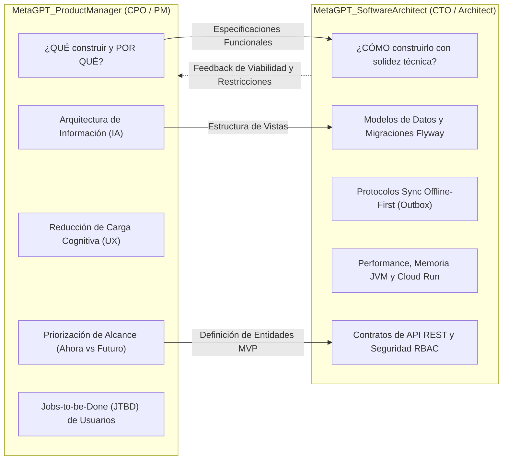

# Arquitectura de Información y Roadmap de Vistas (Buen Bocado ERP)
## Documento Maestro de Planificación Funcional, Jerarquía Visual y Alcance (Ahora vs. Futuro)

---

> **Autor:** MetaGPT_ProductManager (Chief Product Officer & Senior ERP Product Manager)  
> **Destinatario:** Fundador y Dirección General de Buen Bocado ERP  
> **Fecha de Emisión:** 29 de Septiembre de 2026  
> **Versión:** 1.0.0 (Baseline Consolidado)  
> **Estado:** Documento Normativo Aprobado  

---

## 1. Resumen Ejecutivo y Diagnóstico Estratégico

El crecimiento de **Buen Bocado ERP** ha alcanzado un hito crítico: contamos con un backend de alta fidelidad técnica (Java 21 / Spring Boot 3 / PostgreSQL), clientes de campo Offline-First (Flutter) y un portal administrativo web (Angular 17). 

Sin embargo, el diagnóstico del fundador es certero: **la interfaz web comenzaba a acumular demasiadas categorías y controles simultáneos**. Cuando un ERP intenta mostrar todo al mismo tiempo en cada pantalla:
1. **Satura cognitivamente** al usuario de planta y administración (parálisis por análisis).
2. **Mezcla niveles de decisión**: el tablero directivo terminaba coexistiendo con formularios de carga operativa rápida.
3. **Dispersa el foco**: se dificulta distinguir lo que es indispensable para despachar sándwiches hoy de lo que es una optimización futura deseable.

Este documento establece la **Arquitectura de Información (IA) definitiva**, el **Sitemap integral** y el desglose estricto **AHORA (MVP Operativo)** versus **FUTURO (Fase 2 / Escalamiento)** para cada una de las ventanas del ERP.

---

## 2. Marco Metodológico y Definición de Roles

### 2.1 Roles y Responsabilidades: MetaGPT_ProductManager vs. MetaGPT_SoftwareArchitect

Para garantizar el éxito de un producto de misión crítica, la separación de responsabilidades entre Producto y Arquitectura debe ser nítida y complementaria:



#### Matriz RACI de Decisión en Buen Bocado ERP

| Decisión / Artefacto | MetaGPT_ProductManager | MetaGPT_SoftwareArchitect | Fundador / Negocio |
| :--- | :---: | :---: | :---: |
| **Definición de qué pestañas existen en el sistema** | **Aprobador (A)** / **Responsable (R)** | Consultado (C) | Consultado (C) |
| **Jerarquía visual y qué datos van en cada pantalla** | **Responsable (R)** | Consultado (C) | Aprobador (A) |
| **Priorización de alcance (Qué va AHORA vs. FUTURO)** | **Responsable (R)** | Consultado (C) | Aprobador (A) |
| **Diseño del modelo relacional de base de datos** | Consultado (C) | **Responsable (R)** | Informado (I) |
| **Protocolos de sincronización SQLite / Spring Boot** | Consultado (C) | **Responsable (R)** | Informado (I) |
| **Optimización de recursos JVM y Google Cloud Run** | Informado (I) | **Responsable (R)** | Informado (I) |

> **Conclusión pedagógica para el fundador:**  
> El **MetaGPT_ProductManager** es el responsable de definir la experiencia humana, la navegación, la utilidad de negocio y la contención del alcance (evitando que el sistema se vuelva inmanejable).  
> El **MetaGPT_SoftwareArchitect** toma esa definición y construye los cimientos de ingeniería para que el sistema soporte millones de transacciones sin caerse ni corromper datos.

---

### 2.2 ¿Debemos registrar esto en algún lado? ¿Dónde? ¿Por qué sí o por qué no?

**Respuesta contundente: SÍ, absolutamente.**

- **¿Dónde?**  
  En el repositorio del proyecto, bajo la ruta canónica:  
  `docs/requirements/INFORMATION_ARCHITECTURE_AND_ROADMAP.md`  
  con enlace cruzado directo desde el `PRD.md` principal.

- **¿Por qué SÍ?**  
  1. **Evita la amnesia de diseño:** Las discusiones de chat o notas informales se dispersan y se olvidan en pocos días.
  2. **Contrato de trabajo unificado:** Los desarrolladores frontend de Angular y Flutter necesitan saber exactamente qué componentes renderizar y cuáles ocultar sin inventar funcionalidades innecesarias.
  3. **Blindaje contra el "Scope Creep" (desvío de alcance):** Cada vez que alguien proponga una nueva idea ("¿Y si agregamos un botón de pronóstico meteorológico para compras de pan?"), se consulta este documento: si no está en el **AHORA**, se programa formalmente para el **FUTURO** sin interrumpir la salida a producción.
  4. **Trazabilidad de QA (Calidad):** Los casos de prueba automatizados y manuales se validan contra los criterios de aceptación de este documento.

---

### 2.3 ¿Debemos hacerlo ahora o seguir con lo establecido en el PRD?

**Respuesta estratégica: Debe consolidarse AHORA MISMO, antes de continuar codificando.**

Esta pausa reflexiva de arquitectura de información representa una de las mejores prácticas de la ingeniería de software mundial, fundamentada en la **Regla del 1-10-100 de Calidad y Costo**:

```
+---------------------------------------------------------------------------------+
|                         LA REGLA DEL 1 - 10 - 100                               |
+---------------------------------------------------------------------------------+
|  FASE 1: Planificación e Información (Documento Actual)   | Costo de cambio: $1 |
|  FASE 2: Codificación Frontend/Backend (Angular/Spring)   | Costo de cambio: $10|
|  FASE 3: Producción en Planta y Preventistas en Calle     | Costo: $100+        |
+---------------------------------------------------------------------------------+
```

- Reorganizar una pestaña hoy en un documento de arquitectura toma **horas** y cuesta prácticamente **cero**.
- Modificar componentes Angular, servicios RxJS/Signals, consultas SQL y endpoints Spring Boot una vez que la pantalla está a medio construir cuesta **semanas de refactorización y retrabajo**.
- Modificar una pantalla saturada cuando ya hay 10 preventistas y 4 operarios de cocina usándola genera **rechazo del usuario, errores en despachos de pedidos y pérdidas económicas directas**.

Hacer esta pausa hoy es una muestra de madurez gerencial que garantiza velocidad a largo plazo (*"Slow is smooth, smooth is fast"*).

---

## 3. Mapa Integral de Navegación del ERP (Sitemap y Jerarquía)

El portal central de Buen Bocado ERP se organiza en **7 módulos funcionales** con responsabilidades estrictamente desacopladas. Ningún dato se duplica sin justificación de contexto:

```mermaid
flowchart TD
    AppRoot["Buen Bocado ERP (Backoffice Web Angular)"]

    AppRoot --> Tab1["1. 🎯 Dirección & CMI\n(Balanced Scorecard & Metas)"]
    AppRoot --> Tab2["2. 📊 Finanzas & P&L\n(Estado de Resultados, Gastos & Flujo)"]
    AppRoot --> Tab3["3. 🛒 Ventas & Clientes\n(Preventa, Listas de Precios & Cartera)"]
    AppRoot --> Tab4["4. 📦 Compras & Insumos\n(Materias Primas, Proveedores & Stock JIT)"]
    AppRoot --> Tab5["5. 🏭 Fábrica & Calidad\n(Producción JIT, Partes Diarios & Mermas 24h)"]
    AppRoot --> Tab6["6. 🚚 Logística & Reparto\n(Despacho Matutino, Rutas & Entregas)"]
    AppRoot --> Tab7["7. ⚙️ Configuración & Sistema\n(Usuarios, Roles RBAC, Auditoría & Parámetros)"]

    classDef direct fill:#e1f5fe,stroke:#0288d1,stroke-width:2px;
    classDef finance fill:#e8f5e9,stroke:#388e3c,stroke-width:2px;
    classDef sales fill:#fff8e1,stroke:#fbc02d,stroke-width:2px;
    classDef factory fill:#fbe9e7,stroke:#d84315,stroke-width:2px;
    classDef supply fill:#ede7f6,stroke:#512da8,stroke-width:2px;
    classDef logistics fill:#e0f2f1,stroke:#00796b,stroke-width:2px;
    classDef config fill:#eceff1,stroke:#455a64,stroke-width:2px;

    class Tab1 direct;
    class Tab2 finance;
    class Tab3 sales;
    class Tab4 supply;
    class Tab5 factory;
    class Tab6 logistics;
    class Tab7 config;
```



---

## 4. Especificación Detallada por Pestaña: Propósito, AHORA y FUTURO

A continuación se detalla la anatomía completa de cada pestaña, definiendo su **Job-to-be-Done**, su **estructura visual**, qué contiene en el **AHORA (MVP Operativo)** y qué se posterga para el **FUTURO (Fase 2 / Escalamiento)**.

---

### Pestaña 1: 🎯 Dirección & CMI (Balanced Scorecard)

#### Propósito Exclusivo y Job-to-be-Done (JTBD)
- **Audiencia:** Dueño, Fundador, Gerencia General.
- **Propósito:** Brindar una visión holística de alto nivel sobre la salud y viabilidad del negocio en un golpe de vista de 30 segundos, sin enredarse en comprobantes individuales ni transacciones menores.
- **Job-to-be-Done:**  
  > *"Cuando me levanto por la mañana o cierro el mes, quiero saber si la fábrica está ganando dinero, si estamos por encima del punto de equilibrio de sándwiches y si los procesos clave están bajo control, para tomar decisiones de fijación de rumbo sin perder tiempo en detalles operativos."*

#### Jerarquía Visual de la Pantalla
1. **Encabezado Ejecutivo:** Selector de mes/período analizado y alerta de estado global (Semáforo general: Saludable / En Advertencia / Crítico).
2. **KPIs Card Directivas (Top 4 Métricas de Dirección):**
   - Facturación Total despachada vs. Meta.
   - Margen Bruto Porcentual consolidado.
   - EBITDA Operativo acumulado ($ y %).
   - Punto de Equilibrio Ponderado (Total sándwiches requeridos).
3. **Banner Predictivo de Metas por Variedad de Sándwich:**  
   Metas de unidades mínimas a producir/vender desglosadas por producto (Triples Jamón y Queso, Pebetes Salame, Milanesa, etc.) según su peso en la mezcla de ventas.
4. **Matriz Cuadro de Mando Integral (CMI) en 3 Perspectivas Clave:**
   - **Perspectiva Financiera:** (EBITDA, Margen Bruto, Tasa de Devoluciones sobre ventas).
   - **Perspectiva de Procesos Internos:** (Cumplimiento de Frescura 24h, Rendimiento de Fiambres/Pan, Merma en Cocina).
   - **Perspectiva de Clientes:** (Ticket Promedio B2B, Clientes Activos, Rechazo de pedidos).

#### ¿Qué va en el AHORA (MVP Operativo)?
- [x] Selector mensual de período contable.
- [x] 4 tarjetas de KPIs directivos en tiempo real calculados desde el backend.
- [x] Grilla de desglose del Punto de Equilibrio Ponderado por sándwich (volumen del mix, unidades mínimas requeridas, precio promedio y meta en pesos).
- [x] Tabla formal del CMI organizada por las 3 perspectivas estratégicas (Nombre del indicador, Explicación, Fórmula matemática, Valor actual con indicador semafórico, y Meta de mejora).
- [x] Modal liviano para dar de alta un indicador personalizado directo en la perspectiva elegida.

#### ¿Qué se reserva para el FUTURO (Fase 2 / Escalamiento)?
- [ ] Conexión automática con simulador de escenarios "What-If" (ej. "¿Qué pasa con mi punto de equilibrio si el queso sube 20%?").
- [ ] Exportación en PDF en formato presentación ejecutiva con un solo clic para socios/inversionistas.
- [ ] Notificaciones push automáticas a Telegram/WhatsApp del dueño con el resumen matutino diario.
- [ ] Cuarta perspectiva del CMI: Aprendizaje y Crecimiento (Evaluación de rotación del personal y horas de capacitación).

#### Trampas Cognitivas a Evitar en esta Pestaña (Anti-Patrones)
- ❌ **NO incluir:** Formularios de carga de facturas o gastos individuales (eso pertenece a Finanzas).
- ❌ **NO incluir:** Listas de pedidos de clientes o tablas con cientos de filas (eso pertenece a Ventas).
- ❌ **NO incluir:** Detalle de compras de insumos por proveedor (eso pertenece a Compras).

---

### Pestaña 2: 📊 Finanzas & P&L (Estado de Resultados y Flujo)

#### Propósito Exclusivo y Job-to-be-Done (JTBD)
- **Audiencia:** Administrador Contable, Contador Externo, Dueño.
- **Propósito:** Medir la rentabilidad real de la operación mediante la conciliación rigurosa de ingresos devengados, Costo de Mercaderías Vendidas (CMV) por método PEPS, pérdidas por devolución y gastos fijos/variables.
- **Job-to-be-Done:**  
  > *"Cuando concluye un ciclo semanal o mensual, quiero registrar comprobantes de gastos operativos, contrastar los ingresos reales contra el costo de los insumos consumidos y emitir el Estado de Resultados contable, para saber exactamente dónde se fuga el dinero y asegurar la liquidez del negocio."*

#### Jerarquía Visual de la Pantalla
1. **Barra de Acciones Financieras:** Filtro por rango de fechas (desde / hasta), Botón destacado `➕ Registrar Gasto` y Botón `📥 Exportar a Excel`.
2. **KPIs de Rendimiento Contable (6 Tarjetas):**
   - Ventas Totales Despachadas ($).
   - Utilidad Bruta Fabril ($ y %).
   - EBITDA Operativo ($ y alerta superávit/déficit).
   - Punto de Equilibrio Monetario ($).
   - NOF (Necesidades Operativas de Fondos) y Capital de Trabajo ($).
   - CMV Insumos PEPS acumulado ($ y % sobre ventas).
3. **Cuadro Formal: Estado de Resultados Estructurado (P&L):**
   - (+) Ingresos por Ventas de Sándwiches.
   - (-) Costo de Mercaderías Vendidas (Insumos Panadería, Fiambres, Lácteos, Packaging).
   - (=) **Utilidad Bruta**.
   - (-) Pérdidas por Devolución de Sándwiches Vencidos/Dañados (RN-02).
   - (-) Gastos Operativos Fijos (Alquiler de planta, Sueldos, Servicios luz/gas).
   - (-) Gastos Operativos Variables (Fletes, Combustible, Mantenimiento preventivo).
   - (=) **EBITDA**.
   - (-) Amortizaciones y Depreciaciones (Maquinaria cortadora, Cámaras de frío).
   - (=) **EBIT (Resultado Operativo Neto)**.
4. **Listado Paginado de Comprobantes de Gastos Registrados:** Tabla con fecha, categoría, concepto, tipo (fijo/variable), monto y estado.

#### ¿Qué va en el AHORA (MVP Operativo)?
- [x] Filtro por rango de fechas retroactivo y mensual.
- [x] Motor de cálculo backend que integra CMV PEPS con los gastos registrados.
- [x] Estado de Resultados interactivo con desglose de montos e incidencias porcentuales.
- [x] Modal de registro de gastos operativos con validación de categoría, tipo (fijo vs. variable) y monto.
- [x] Tabla de auditoría de gastos recientes con opción de borrado/ajuste.
- [x] Exportación a Excel profesional (.xlsx) mediante servicio Apache POI en modo streaming.

#### ¿Qué se reserva para el FUTURO (Fase 2 / Escalamiento)?
- [ ] Carga y visualización de fotos/PDFs de comprobantes fiscales con reconocimiento óptico de caracteres (OCR) para autocompletar CUIT y montos.
- [ ] Integración directa con Web Services de AFIP/ARCA para facturación electrónica y libro de IVA digital.
- [ ] Conciliación bancaria automática mediante importación de extractos bancarios (CBU/Mercado Pago).
- [ ] Proyección de Flujo de Caja (Cash Flow Forecasting) a 30, 60 y 90 días.

#### Trampas Cognitivas a Evitar en esta Pestaña
- ❌ **NO incluir:** Detalle de recetas ni gramos de mayonesa por sándwich (eso es de Fábrica).
- ❌ **NO incluir:** Edición de clientes o direcciones de entrega (eso es de Ventas).

---

### Pestaña 3: 🛒 Ventas & Clientes (Comercial y Preventa)

#### Propósito Exclusivo y Job-to-be-Done (JTBD)
- **Audiencia:** Preventistas, Encargado Comercial, Administrador de Cuentas.
- **Propósito:** Centralizar el ciclo comercial completo: gestión de clientes (B2B kioscos/cafeterías y B2C particulares), listas de precios pactadas, toma de pedidos y seguimiento de cuentas corrientes.
- **Job-to-be-Done:**  
  > *"Cuando un preventista sale a la calle o un cliente hace un encargo, quiero registrar el pedido con su precio acordado, verificar que no supere su límite de crédito y saber exactamente cuánto nos debe cada comercio, para maximizar las ventas sin acumular morosidad."*

#### Jerarquía Visual de la Pantalla
1. **Sub-pestañas / Modos de Vista Comercial:**
   - **Sub-vista 1: Pedidos del Día & Encargos JIT** (Flujo de pedidos a despachar).
   - **Sub-vista 2: Cartera de Clientes & Cuentas Corrientes** (Saldos deudores y cobranzas).
   - **Sub-vista 3: Listas de Precios & Catálogo** (Precios base, mayoristas y bonificaciones).
2. **KPIs Comerciales del Día:**
   - Pedidos Ingresados hoy (unidades y $).
   - Clientes Morosos con límite de crédito excedido.
   - Cobranzas del Día registradas.
3. **Buscador Rápido y Filtros:** Búsqueda por Razón Social, CUIT, Preventista o Estado (Pendiente, Confirmado, Despachado, Cancelado).

#### ¿Qué va en el AHORA (MVP Operativo)?
- [x] Tabla unificada de Pedidos con estado en tiempo real y detalle de sándwiches solicitados.
- [x] Módulo de creación y edición rápida de pedidos con cálculo automático de totales.
- [x] Padrón de Clientes con Razón Social, CUIT/DNI, Teléfono, Dirección y Límite de Crédito.
- [x] Módulo de Cuenta Corriente: Registro de cobranzas con recibos y saldo resultante visible.
- [x] Matriz de Listas de Precios por producto para evitar precios digitados manualmente en campo.

#### ¿Qué se reserva para el FUTURO (Fase 2 / Escalamiento)?
- [ ] Portal B2B de autogestión para kioscos (que los propios comercios puedan pedir desde una web sin esperar al preventista).
- [ ] Scoring crediticio automático basado en puntualidad histórica de pagos.
- [ ] Liquidación automática de comisiones escalonadas a preventistas según cobranza efectiva.
- [ ] Integración con WhatsApp Business API para envío automático de confirmación de pedido al cliente.

#### Trampas Cognitivas a Evitar en esta Pestaña
- ❌ **NO incluir:** Estado de resultados contable ni cálculo de EBITDA (eso es de Finanzas).
- ❌ **NO incluir:** Inventario de harina, jamón o fardos de pan crudo (eso es de Compras).

---

### Pestaña 4: 📦 Compras & Insumos (Proveedores y Materias Primas)

#### Propósito Exclusivo y Job-to-be-Done (JTBD)
- **Audiencia:** Encargado de Compras, Jefe de Depósito, Administrador.
- **Propósito:** Garantizar el abastecimiento continuo de materias primas críticas (pan de miga, pebetes, fiambres, quesos, aderezos y packaging) al menor costo y sin generar sobrestock de insumos perecederos.
- **Job-to-be-Done:**  
  > *"Cuando consolidamos la demanda de sándwiches de la tarde para producir, quiero saber con precisión matemática qué ingredientes faltan en la cámara de frío y emitir órdenes de compra a proveedores confiables, para que no falte ni un gramo de jamón ni se desperdicie mercadería por vencimiento."*

#### Jerarquía Visual de la Pantalla
1. **Asistente de Compras Matutino JIT (Widget Clave):**
   - Comparación instantánea: Demanda proyectada de sándwiches vs. Stock disponible en cámara = **Requerimiento Neto de Compra**.
2. **KPIs de Depósito e Insumos:**
   - Valor Total del Inventario de Insumos ($).
   - Insumos Críticos con Stock por debajo del punto de reorden (Alerta roja).
   - Cuentas por Pagar a Proveedores vencidas ($).
3. **Pestañas Internas de Gestión:**
   - **Sub-vista 1: Stock de Insumos & Cámaras** (Existencias físicas, unidades de medida kg/un/pack, lote y vencimiento).
   - **Sub-vista 2: Órdenes de Compra & Recepción** (Estado de pedidos a molinos y frigoríficos).
   - **Sub-vista 3: Directorio de Proveedores** (Datos fiscales, condiciones de pago 7/15/30 días).

#### ¿Qué va en el AHORA (MVP Operativo)?
- [x] Catálogo maestro de materias primas con unidad de medida estandarizada (kg, litros, unidades, fardos).
- [x] Control de stock actual de insumos con niveles mínimos de alerta.
- [x] Registro ágil de recepción de compras (ingreso de insumos, costo unitario de compra y actualización inmediata del stock).
- [x] Registro del costo de compra para alimentar el costeo PEPS en Finanzas.
- [x] Directorio de proveedores básicos con contacto y forma de pago pactada.

#### ¿Qué se reserva para el FUTURO (Fase 2 / Escalamiento)?
- [ ] Generación automática de órdenes de compra en PDF enviadas por correo electrónico a proveedores habituales al tocar un botón.
- [ ] Trazabilidad de números de lote de insumos del proveedor y certificados de calidad bromatológica (SENASA).
- [ ] Matriz comparativa histórica de precios por proveedor para recomendar la opción más económica.
- [ ] Lector de códigos de barra / DataMatrix mediante terminales móviles para la recepción de mercadería en muelle.

#### Trampas Cognitivas a Evitar en esta Pestaña
- ❌ **NO incluir:** Carga de gastos operativos de alquiler o servicios de luz (eso pertenece a Finanzas).
- ❌ **NO incluir:** Programación de turnos de operarios de corte (eso pertenece a Fábrica).

---

### Pestaña 5: 🏭 Fábrica & Calidad (Producción JIT y Mermas)

#### Propósito Exclusivo y Job-to-be-Done (JTBD)
- **Audiencia:** Jefe de Producción, Encargado de Planta, Operarios de Cocina.
- **Propósito:** Transformar los pedidos comerciales en órdenes de elaboración de sándwiches con frescura de 12-24 horas, controlando el consumo real de ingredientes según las recetas (BOM) y auditando mermas y desperdicios.
- **Job-to-be-Done:**  
  > *"Cuando inicia el turno de producción de la tarde, quiero visualizar cuántos sándwiches de cada variedad debemos armar, controlar que el gramaje de jamón y queso se respete según la receta, y asentar los sobrantes y mermas, para garantizar la máxima frescura y la rentabilidad del lote."*

#### Jerarquía Visual de la Pantalla
1. **Monitor de Producción JIT del Día:**
   - Contador de unidades programadas para el despacho del día siguiente.
   - Tasa de cumplimiento de elaboración (Sándwiches armados / Sándwiches requeridos).
2. **KPIs de Rendimiento de Planta:**
   - Merma total de elaboración (%).
   - Desperdicio de pan de miga y recortes de fiambre (kg y $).
   - Rendimiento del lote respecto a la receta estándar.
3. **Área de Trabajo en Dos Módulos:**
   - **Módulo A: Partes Diarios de Elaboración / Lotes:** Apertura, avance y cierre de partidas de fabricación con descuento automático de insumos.
   - **Módulo B: Recetas y Estructura de Producto (BOM - Bill of Materials):** Detalle de ingredientes por variedad (ej: Triple JyQ = 3 fetas de pan miga + 45g jamón cocido + 40g queso tybo + 15g aderezo).

#### ¿Qué va en el AHORA (MVP Operativo)?
- [x] Monitor de órdenes de producción consolidadas a partir de los pedidos de preventa.
- [x] Maestro de Recetas (BOM) con cantidades estándar de ingredientes por unidad o docena.
- [x] Registro del Parte Diario de Fabricación: Unidades reales elaboradas y fecha/hora de envasado (regla de frescura 24h).
- [x] Registro manual de Mermas de Producción (recortes no utilizables, pan roto, producto dañado) con impacto contable inmediato.
- [x] Descuento de stock de insumos por receta al cerrar la orden de producción.

#### ¿Qué se reserva para el FUTURO (Fase 2 / Escalamiento)?
- [ ] Interfaz táctil de cocina (KDS - Kitchen Display System) en tablet rugerizada sin teclado físico, con botones gigantes de paso a paso.
- [ ] Integración con balanzas electrónicas industriales vía puerto serie/USB para pesaje automático de ingredientes en mesa de armado.
- [ ] Impresión automática de etiquetas térmicas adhesivas con código QR, lote de elaboración y hora exacta de vencimiento para cada sándwich.
- [ ] Algoritmo de planificación de capacidad de máquinas cortadoras y distribución de operarios por línea.

#### Trampas Cognitivas a Evitar en esta Pestaña
- ❌ **NO incluir:** Consulta de saldos adeudados por kioscos ni cobranzas (eso es de Ventas).
- ❌ **NO incluir:** Facturación o cálculo de impuestos (eso es de Finanzas).

---

### Pestaña 6: 🚚 Logística & Reparto (Despacho Matutino y Entregas)

#### Propósito Exclusivo y Job-to-be-Done (JTBD)
- **Audiencia:** Encargado de Logística, Choferes / Repartidores matutinos.
- **Propósito:** Organizar el despacho físico de los sándwiches elaborados durante la madrugada (franja de 05:00 a 11:00 AM), asegurando que cada comercio reciba su pedido a tiempo y en óptimas condiciones de refrigeración.
- **Job-to-be-Done:**  
  > *"A las 05:00 AM cuando cargamos las camionetas refrigeradas, quiero una hoja de ruta ordenada geográficamente con los comercios a visitar, las cantidades de sándwiches a bajar y los cobros a realizar, para cumplir los repartos antes de que abran los kioscos sin extravíos ni demoras."*

#### Jerarquía Visual de la Pantalla
1. **Monitor de Turno Matutino de Reparto:**
   - Total de bultos/cajas cargados en vehículos vs. despachados.
   - Estado de los circuitos de entrega (Zona Centro, Zona Norte, Zona Sur, Clientes Redes Especiales).
2. **Generador y Vista de Hoja de Ruta:**
   - Selector de fecha y vehículo / repartidor asignado.
   - Secuencia recomendada de paradas de entrega.
   - Enlace directo con coordenadas de Google Maps para navegación GPS directa.
3. **Registro de Novedades en Entrega:**
   - Confirmación de entrega exitosa.
   - Registro en el acto de sándwiches devueltos por vencimiento del día anterior (alimentando la regla RN-02).
   - Recibo provisional de cobranza en efectivo/transferencia entregado al comercio.

#### ¿Qué va en el AHORA (MVP Operativo)?
- [x] Vista consolidada de despachos matutinos agrupados por fecha y zona de entrega.
- [x] Generación de la Hoja de Ruta imprimible (y visible en tablet/móvil) con nombre del comercio, dirección exacta, teléfono y detalle de cajas.
- [x] Control de estado de entrega de cada pedido: `Pendiente de Salida` ➔ `En Tránsito` ➔ `Entregado` ➔ `Rechazado`.
- [x] Registro de devoluciones de producto en el punto de entrega con motivo tipificado (vencido, paquete abierto, no solicitado).

#### ¿Qué se reserva para el FUTURO (Fase 2 / Escalamiento)?
- [ ] Algoritmo de optimización de rutas con inteligencia de tráfico en tiempo real (evitar congestiones y minimizar consumo de combustible).
- [ ] Monitoreo por GPS en tiempo real de la posición de las camionetas en un mapa centralizado.
- [ ] Firma digital del cliente en la pantalla del celular del repartidor como acuse de recibo de mercadería.
- [ ] Control de telemetría de temperatura de la caja refrigerada del furgón para auditoría de cadena de frío.

#### Trampas Cognitivas a Evitar en esta Pestaña
- ❌ **NO incluir:** Carga de recetas de sándwiches ni configuración de ingredientes (eso es de Fábrica).
- ❌ **NO incluir:** Balances contables o amortizaciones de vehículos (eso es de Finanzas).

---

### Pestaña 7: ⚙️ Configuración & Auditoría (Seguridad y Parámetros)

#### Propósito Exclusivo y Job-to-be-Done (JTBD)
- **Audiencia:** Encargado Informático (Super Admin), Administrador Contable.
- **Propósito:** Mantener la seguridad, gobernanza, permisos de usuarios y parámetros globales de funcionamiento de la plataforma en un entorno seguro y restringido.
- **Job-to-be-Done:**  
  > *"Cuando un empleado ingresa o cambia de rol, o cuando necesitamos ajustar políticas de frescura, límites de crédito o revisar quién modificó un dato sensible, quiero un panel seguro y centralizado para gobernar el sistema sin alterar la operativa diaria."*

#### Jerarquía Visual de la Pantalla
1. **Secciones de Configuración Clara:**
   - **Sub-vista 1: Usuarios y Roles RBAC** (Altas, bajas, perfiles: Administrador, Preventista, Cocina, Cajero, Chofer).
   - **Sub-vista 2: Políticas Operativas de Planta** (Horas de frescura máxima, tolerancia de mermas, política de créditos).
   - **Sub-vista 3: Registro de Auditoría Inmutable (Audit Trail)** (Log histórico: Quién, Cuándo, Qué modificó, Dirección IP).
   - **Sub-vista 4: Estado de Servidores y Sincronización** (Salud de Spring Boot, PostgreSQL, cola de sincronización de móviles Drift).

#### ¿Qué va en el AHORA (MVP Operativo)?
- [x] Gestión de Usuarios: Nombre, email, contraseña con hash seguro y asignación de rol.
- [x] Control de acceso por roles (RBAC) para restringir vistas confidenciales (ej. solo Admin ve EBITDA y P&L).
- [x] Configuración de parámetros clave del negocio (Nombre de planta, umbral de días de crédito).
- [x] Visor de logs de auditoría básica para operaciones críticas (creación de pedidos, anulación de facturas, bajas de stock).
- [x] Monitor de estado de sincronización y conectividad de servicios.

#### ¿Qué se reserva para el FUTURO (Fase 2 / Escalamiento)?
- [ ] Integración con autenticación corporativa Single Sign-On (SSO / Google Workspace / Microsoft Entra ID).
- [ ] Configuración de alertas automáticas vía Webhooks hacia sistemas externos (Slack, Discord, ERPs contables externos).
- [ ] Herramienta visual de backup y restauración de bases de datos desde el navegador con un clic.
- [ ] Gestión multitenant / multifábrica (si Buen Bocado decide abrir una segunda planta de elaboración en otra ciudad).

#### Trampas Cognitivas a Evitar en esta Pestaña
- ❌ **NO incluir:** Ninguna operación transaccional de venta, compra o cocina.

---

## 5. Matriz Consolidada de Alcance: AHORA (MVP Operativo) vs. FUTURO (Escalamiento)

Esta matriz resume de manera ejecutiva el alcance comprometido para la versión actual y congela las tentaciones de sobrecarga:

| Módulo / Pestaña | AHORA (MVP Operativo - Prioridad Inmediata) | FUTURO (Fase 2 / Escalamiento Posterior) |
| :--- | :--- | :--- |
| **1. 🎯 Dirección & CMI** | • 4 KPIs directivos (Ventas, Margen, EBITDA, Punto Eq.)<br>• Banner predictivo de metas de sándwiches<br>• Matriz CMI (3 perspectivas: Finanzas, Procesos, Clientes)<br>• Alta de indicadores custom en modal | • Simulador de escenarios What-If en tiempo real<br>• Exportación ejecutiva a PDF corporativo<br>• Notificaciones matutinas automáticas a WhatsApp/Telegram<br>• Perspectiva de Aprendizaje & Crecimiento |
| **2. 📊 Finanzas & P&L** | • Estado de Resultados estructurado (Ventas - CMV - Gastos)<br>• Costeo PEPS de insumos consumidos<br>• Registro clasificado de gastos fijos y variables<br>• 6 KPIs contables (NOF, Margen, EBITDA, Punto Eq.)<br>• Exportación masiva a Excel (.xlsx) con Apache POI | • OCR de facturas y tickets fiscales<br>• Facturación electrónica con AFIP/ARCA<br>• Conciliación bancaria automática con Mercado Pago<br>• Proyección de flujo de fondos a 90 días |
| **3. 🛒 Ventas & Clientes** | • Lista unificada de pedidos con estados operativos<br>• Padrón de clientes B2B/B2C con límite de crédito<br>• Registro de cobranzas y cuentas corrientes<br>• Listas de precios pactadas por producto | • Portal B2B de autogestión para comercios<br>• Scoring crediticio predictivo<br>• Liquidación automática de comisiones escalonadas<br>• Avisos automáticos de pedido por WhatsApp |
| **4. 📦 Compras & Insumos** | • Asistente de cálculo de compra JIT vs. stock de cámaras<br>• Catálogo maestro de materias primas con unidades (kg/u)<br>• Registro ágil de recepción de compras y actualización de stock<br>• Padrón básico de proveedores | • Envío automático de órdenes de compra en PDF por email<br>• Trazabilidad bromatológica de lotes SENASA del proveedor<br>• Comparativa histórica de precios por proveedor<br>• Lectura con código de barras en muelle de recepción |
| **5. 🏭 Fábrica & Calidad** | • Monitor de órdenes de producción consolidadas del día<br>• Recetas maestras (BOM) con gramajes por variedad<br>• Partes diarios de elaboración y control de frescura 24h<br>• Registro de mermas y sobrantes de cocina | • KDS táctil de cocina en tablets rugerizadas<br>• Balanzas digitales conectadas por USB/Bluetooth<br>• Impresión de etiquetas térmicas con código QR de vencimiento<br>• Planificación algorítmica de capacidad de líneas |
| **6. 🚚 Logística & Reparto** | • Hoja de ruta matutina ordenada por zona de reparto<br>• Enlace con navegación en Google Maps<br>• Control de estados de entrega (Cargado, En Viaje, Entregado)<br>• Registro de devoluciones en el acto en el comercio | • Optimización de rutas con IA según tráfico en vivo<br>• Seguimiento de vehículos por GPS en tiempo real<br>• Firma digital en pantalla móvil como remito digital<br>• Telemetría de cadena de frío en camionetas |
| **7. ⚙️ Configuración & Sistema**| • Administración de usuarios y credenciales seguras<br>• Control de acceso por roles (RBAC)<br>• Parámetros generales de planta y tolerancias<br>• Auditoría inmutable (Audit log) de operaciones críticas | • Autenticación federada SSO (Google / Microsoft)<br>• Disparadores y webhooks hacia sistemas externos<br>• Backups con 1-clic desde UI<br>• Soporte multitenant para múltiples plantas |

---

## 6. Guías de Consistencia Visual y Reducción de Fatiga Cognitiva

Para que la experiencia de usuario sea fluida y profesional entre las distintas ventanas, se adoptan los siguientes principios de diseño universal:

### 6.1 Regla del Golpe de Vista (Visual Anchoring)
- Toda pantalla debe presentar en sus **primeros 250 píxeles verticales** el resumen de estado (3 a 5 tarjetas de métricas o estado del turno).
- El usuario nunca debe verse obligado a hacer scroll para enterarse de si hay un problema grave en su área.

### 6.2 Semántica de Colores y Tokens de Estado
| Estado / Intención | Color Principal | Significado Operativo en Buen Bocado |
| :--- | :--- | :--- |
| **Éxito / Saludable** | Verde esmeralda (`#10b981`) | Ventas cobradas, EBITDA positivo, entregas cumplidas, stock suficiente. |
| **Advertencia / Alerta** | Ámbar cálido (`#f59e0b`) | Stock próximo al mínimo, cliente cerca del límite de crédito, margen estrecho. |
| **Peligro / Crítico** | Carmesí oscuro (`#ef4444`) | Merma excesiva, lote vencido, cliente moroso bloqueado, EBITDA negativo. |
| **Informativo / Neutro**| Azul pizarra (`#3b82f6` / `#64748b`) | Estados de tránsito, órdenes en preparación, indicadores predictivos. |

### 6.3 Micro-copia Humana y Libre de Tecnicismos
- En lugar de etiquetas frías como `"MUTATION_OUTBOX_PENDING"`, la interfaz debe indicar: `"3 pedidos pendientes de sincronizar con el servidor central"`.
- En lugar de `"BATCH_EXPIRY_OVERDUE"`, la interfaz debe indicar: `"Alerta: 12 pebetes han superado las 24 horas de frescura"`.

---

## 7. Plan de Acción y Próximos Pasos

1. **Aprobación de la Dirección General:** Confirmación del fundador de que este ordenamiento funcional refleja plenamente su visión del negocio.
2. **Refinamiento del Frontend Angular (Web Admin):**
   - Asegurar que la barra de navegación lateral (Sidebar) active exactamente estas rutas desacopladas.
   - Ajustar las vistas actuales para que ninguna pestaña contenga datos correspondientes a otra ventana.
3. **Validación con MetaGPT_SoftwareArchitect:**
   - Confirmar que los DTOs de Spring Boot y las migraciones Flyway ya modeladas cubren con exactitud todos los campos definidos en la columna **AHORA**.
   - Proteger los endpoints con los roles RBAC correspondientes.
4. **Puesta a Disposición de los Clientes Flutter:**
   - Orientar la app de preventistas únicamente a las necesidades de la Pestaña 3 (Ventas) y Pestaña 6 (Logística de campo).
   - Orientar la terminal de mostrador (POS) al cobro rápido sin interferir con las pantallas administrativas.

---

> **Compromiso de Producto:**  
> Con este documento, Buen Bocado ERP adquiere un diseño funcional de nivel mundial: limpio, intuitivo, ágil para operar hoy y robusto para escalar mañana.
